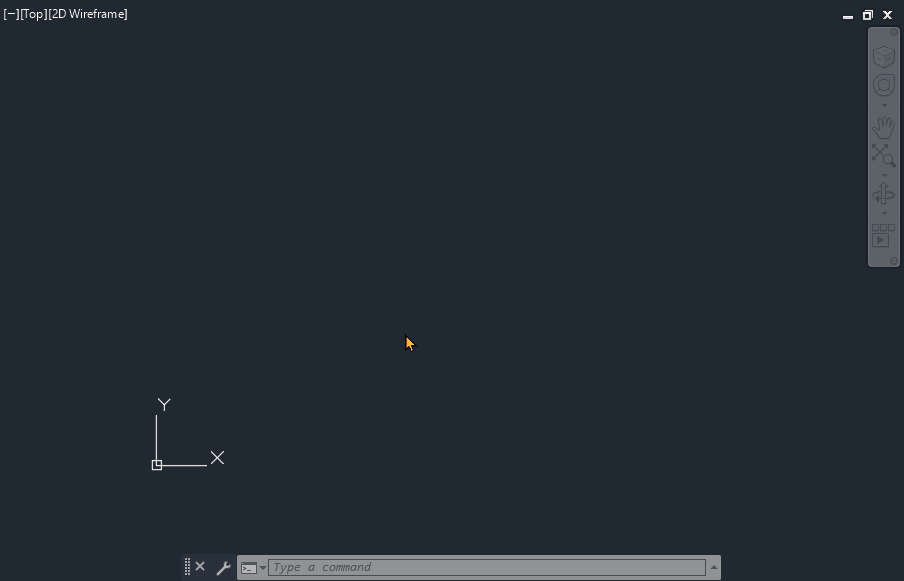
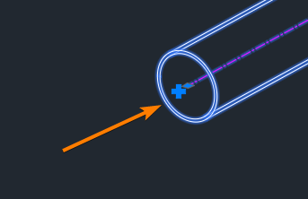
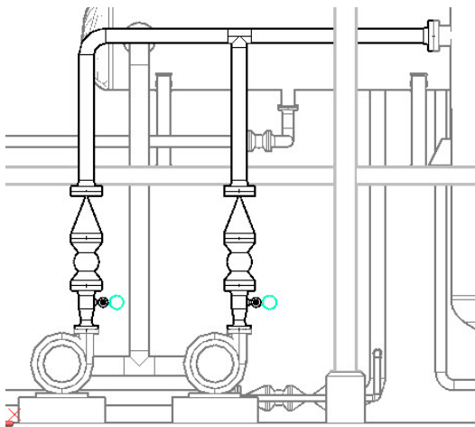

# 1. CADWorx® Plant Training
<p align="center">
  
</p>

- [1. CADWorx® Plant Training](#1-cadworx-plant-training)
  - [1.1. About](#11-about)
  - [1.2. Before you Begin](#12-before-you-begin)
    - [1.2.1. Introduction](#121-introduction)
      - [1.2.1.1. Products](#1211-products)
  - [1.3. Session 1: Fundamental Skills](#13-session-1-fundamental-skills)
    - [1.3.1. Getting Started with CADWorx® (est 2 hours)](#131-getting-started-with-cadworx-est-2-hours)
      - [1.3.1.1. In this section](#1311-in-this-section)
      - [1.3.1.2. Launching and setup](#1312-launching-and-setup)
      - [1.3.1.3. Connecting to a Config File](#1313-connecting-to-a-config-file)
      - [1.3.1.4. Connecting to a Project File](#1314-connecting-to-a-project-file)
      - [1.3.1.5. Creating an initial route: Working with the primary functions of CADWorx](#1315-creating-an-initial-route-working-with-the-primary-functions-of-cadworx)
    - [1.3.2. Auto-Routing Options Review](#132-auto-routing-options-review)
    - [1.3.3. Palette Review](#133-palette-review)
  - [1.4. Hands-On Practice](#14-hands-on-practice)
    - [1.4.1. Construct Civil/Structural Foundation](#141-construct-civilstructural-foundation)
    - [1.4.2. Construct Equipment](#142-construct-equipment)
    - [1.4.3. Route Piping](#143-route-piping)
    - [1.4.5. Generate Orthographics](#145-generate-orthographics)
    - [1.4.6. Generate Isometrics](#146-generate-isometrics)
    - [1.4.7. Review and Wrap-Up](#147-review-and-wrap-up)

## 1.1. About
This document outlines a two-day training course for CADWorx® Plant Professional by Hexagon®, a 3D plant design and modeling software that installs on top of AutoCAD® as an extension.  
The training is broken into two sections and emphasizes quickly learning and applying skills in piping design for new users. It's meant for new CADWorx® Plant end users who are primarly creating Orthographic and Isometric deliverables.  
It assumes the user has a basic understanding of AutoCAD®, and is familiar with the AutoCAD® command language.

Reference **Legacy CADWorx Plant Training.pdf** for the old training.

## 1.2. Before you Begin
- Install AutoCAD® Plant 3D
- Install CADWorx® Plant
- Ensure both applications are licensed (CADWorx shortcut launches with no errors)
- Download the training.zip to your desktop and unzip.
### 1.2.1. Introduction
- Welcome and Introductions: Brief introduction of the trainer and participants
- Overview of CADWorx®: Purpose and benefits of the application
#### 1.2.1.1. Products
- CADWorx® Product Suite:
  - CADWorx® Plant: 3D piping for plant design and modeling software
  - CADWorx® Equipment: Specialized tool for equipment modeling and design
  - CADWorx® Structure: Structural steel and concrete modeling software
  - CADWorx® P&ID: Intelligent process and instrumentation diagramming tool
- ECE Design Plugins:
  - BUBBLEWorx: Tool for creating and managing bubble annotations in drawings
  - VIEWWorx: Utility for managing and customizing view settings in CADWorx®
  - ISOWorx: Solution for generating and managing isometric drawings
  - ANNOWorx: Tool for creating and managing annotations in CADWorx® models
  - MTOWorx: Material takeoff tool for generating accurate material lists

- Objectives of the Training: What the users will learn and achieve by the end of the training
## 1.3. Session 1: Fundamental Skills

### 1.3.1. Getting Started with CADWorx® (est 2 hours)
#### 1.3.1.1. In this section
- How to connect to a CADWorx Config file (.cfg) and a CADWorx Project File, (.prj)
- How to use Autorouting in CADWorx
- How to use the Specification View Palette
- How to use the Component List
#### 1.3.1.2. Launching and setup

  > _Note: before launching, consider right clicking the icon, going to properties, and setting /nologo on the shortcut to remove the AutoCAD startup logo._
  1. Download the training.zip to your desktop and unzip.
  2. Click the CADWorx® Plant icon on the desktop  
  
     a. Optional: If it doesn't launch, you may run the setup profile utility:  
       
     b. Optional: you might need to run the CADWorx64Wrapper batch file **(as an administrator)**:  
       
  > _Note: Did CADWorx launch successfully? Try running the CADWORXABOUT command in the command line to verify._
  3. Save a new drawing titled "start.dwg" in your ./training folder.
#### 1.3.1.3. Connecting to a Config File

  4. In AutoCAD, type in SETUP to select the config file. (*.cfg)  
  > _Note: Save your changes, but do not close the dialog._
       
  5. In the setup dialog, go to Configuration Settings > "SpecificationDirectory". Select the "..." dialog and navigate to the ./training folder. Save Changes and close.  
> _Note: This sets the location where your *.prj files are stored for your project. Your company may have specific locations (or network locations) where *prj files are stored._

#### 1.3.1.4. Connecting to a Project File

  6. Open your spec view palette  
       
  7. Select your PRJ file and click open.  Then choose your specification (use a carbon steel class 150 for now)
       

#### 1.3.1.5. Creating an initial route: Working with the primary functions of CADWorx

Let's get some piping components into the drawing, to get us started.

  8. Create an initial route:
  > _Note: Commands after "PIPW" are all ran **inside** that command_.

```
Z A
PIPW enter 0,0,0 enter
move east, 24  
choose 90 LR  
move north, 48  
move east, 24  
pick gate valve  
pick RF flange  
pick standard gasket  
left click on the right side of the route  
enter to end the command  
```
  

  9.  Edit the visual mode:
  > _Note: These are general visual settings for working in CADWorx® Plant.  They are not necessary but usually preferred._  

```
ISOLINES 0  
DISPSILH 1  
REGEN  

```

  10.  Hold down your left shift key and your middle mouse button to rotate the screen. Position to where you can see the 'starting' tie point in your route in an iso view.
  11.  Add elevation to the route:

```
Left click the design grip (+) on the open end of your route to continue autorouting.
west 24
P (to change plane to Z axis)
elevation 48
west 48
L (for component list)
Pick Blind Flange, and standard gasket.
```


  12.  Add inline components
```
search for "check" in your spec view palette. select it.
Use S or E to change the flow of the check
Left click near the east end of the flanged gate connection, and click to add inline.
```


  12.  Add tee components
```
select your pipe route near the origin and click the inline design grip (+)
type "mid" while placing tee, to select center of pipe.
south x.x
east x.x (near the middle of the east most route)
type "PER" and select the pipe route to connect to.
choose "TEE" from the dialog
```


  12.  Add reducing components
```
c:CHANGESIZE Manual.
Select all components on the "bypass" you just routed, minus the the tees.
Choose 4" for the reduction size.
On the East connection, choose a reducing component (CONC reducer)
On the West connection, choose to change current component.
```


  13.  Add inline olets
```
In your specview palette, change Main 4", Reduction 1".
Check your specview pallete settings > threaded on.
search or find "THRD-O-LET" in your specview pallete and select.
while placing the olet, type in NEA for a "near" snap.
click on the bypass parallel to the pipe route.
while placing along length of pipe, use "P" to select the east end, 2" away from weld.
place olet on the top pipe quadrant
```


  13.  Route off olet
```
In your specview palette, change Main 4", Reduction 1".
Check your specview pallete settings > threaded on.
search or find "THRD-O-LET" in your specview pallete and select.
while placing the olet, type in NEA for a "near" snap.
click on the bypass parallel to the pipe route.
while placing along length of pipe, use "P" to select the east end, 2" away from weld.
place olet on the top pipe quadrant
```


### 1.3.2. Auto-Routing Options Review
In this section we routed some components using various tools in the autoroute command. Let's take a closer look at the various commands available.

While Autorouting from NO start point, or the END of an open component, here are the various commands available:

<p align="left">
  
</p>

| Command         | Description |
|-----------------|-------------|
| component <span style="color:orange">**L**</span>ist  |open component list, parts that can be routed with your current spec, fitting type, and nominal size.             |
| <span style="color:orange">**S**</span>lope           |slope the current route             |
| s<span style="color:orange">**K**</span>ew            |skew the current route by * degrees             |
| <span style="color:orange">**E**</span>levation       |elevate the current route            |
| <span style="color:orange">**P**</span>lane           |change the XY plane to XZ or ZY             |
| <span style="color:orange">**R**</span>eference       |change position based on other objects             |
| <span style="color:orange">**F**</span>itting Mode    |swap to socket, threaded, welded mode             |
| el<span style="color:orange">**B**</span>ow type      |change to LR, SR, miter el on autorout             |
| <span style="color:orange">**U**</span>ndo            |undo last step             |
| <span style="color:orange">**C**</span>onnect         |auto connect to a selected point             |
| <span style="color:orange">**T**</span>oggle Length   |measure length from elbow weld or corner             |
| <span style="color:orange">**A**</span>lignment       |align route to a pipe quadrant         |

While Autorouting from inline a pipe component, here are the various commands available:

<p align="left">
  
</p>

| Command         | Description |
|-----------------|-------------|
| component <span style="color:orange">**L**</span>ist            |open component list, for inline parts that can be routed with your current spec, fitting type, and nominal size.             |
| poin<span style="color:orange">**T**</span> distance            |pick a point to measure distance from             |
| <span style="color:orange">**C**</span>omponent distance        |pick a component to measure distance from             |
| <span style="color:orange">**P**</span>ipe end point distance   |toggle pipe end point measuring from            |
| insertion <span style="color:orange">**J**</span>ustification   |select part on your component to measure distance from             |

Here are other useful commands/utilities in AutoCAD when routing pipe:
- Cadworx-plant-commands-quick-reference.txt
- point filters (.x, .y, .z)
- M2P
- 


<center><span style="color:orange; font-size: 2em;">**Knowledge Check!**</span></center>


<span style="color:blue">**Before we continue, let's review the Piping Rules located in the SETUP dialog.**</span>

### 1.3.3. Palette Review

**Spec View Palette**

<p align="center">
  
</p>

> _Note: Many components can be dropped from the command line using their CADWorx command in CEDIT_

| Number | |
|--------|---|
| 1      |Spec View Settings (14,15,16)|
| 2      |Open Spec Editor   |
| 3      |Line Number Setup   |
| <span style="color:orange">**4**</span>      |c:C2A (Set size, spec, line num)    |
| <span style="color:orange">**5**</span>      |Current prj file   |
| <span style="color:orange">**6**</span>      |Current Main size   |
| <span style="color:orange">**7**</span>      |Current Reduction size   |
| <span style="color:orange">**8**</span>      |Current Specification   |
| <span style="color:orange">**9**</span>      |Current Line Number   |
| 10     |Search line numbers   |
| 11     |Search components   |
| 12     |Current components based on main/reduction and spec   |
| 13     |Custom data fields in PRJ file   |
| 14     |Color Options, how the component list (12) is colored   |
| 15     |Display Options, how the component list (12) is listed   |
| <span style="color:orange">**16**</span>     |Component Options, which components are shown based on type   |

**Line View Palette**

<p align="center">
  
</p>

> _Note: Most of these settings can be controlled via the LINEISOLATE command._    
> _Consider editing your pgp file for quick access to LINEISOLATE_

| Number | |
|--------|---|
| 1      |Line view settings   |
| **2**      |Select component to isolate   |
| 3      |Select rows to isolate   |
| **4**      |Show All   |
| **5**      |Refresh line view list    |
| 6      |Full or Partial Isolation   |
| 7      |Line view list accordion panel   |
| 8      |Search filter Line view list   |
| 9      |List of line numbers and properties   |
| 10     |Advanced Search   |


**Clash Management Palette**
<p align="center">
  
</p>


| Number | |
|--------|---|
| 1      |Toggle clash detection   |
| 2      |Show or hide clashes   |
| 3      |Soft Clash Volume list   |
| 4      |Refresh, delete, zoom, or create new soft clash bodies   |
| 5      |Refresh hard clashes   |
| 6      |Zoom to selected clash   |

 _Note: A soft clash volume is typically an empty volume that is reserved for operational use._


**Discontinuity View Palette**

<p align="center">
  
</p>

**Insulation Palette**

<p align="center">
  
</p>

**Pipe Support Modeler**

<p align="center">
  
</p>


## 1.4. Hands-On Practice


<p align="center">
  
</p>

Guided exercise to construct a small skid piping model for a fictional project.

 - 2 pumps
 - Horizontal vessel
 - Vertical Vessel
 - ~6 pipe routes

### 1.4.1. Construct Civil/Structural Foundation

Here's what we'll do in this section:

- Make a steel frame out of line segments, using SFRAME
- Create W-shape columns and Beams on the frame
- Create a Foundation with Piers, attached to the columns.
- Create secondary concrete pads for pumps.

1. Open CADWorx Structure.
2. Save a new drawing in training\e_projects\S1.dwg
3. c:SFRAME, using the guidelines below.

<p align="center">
  
</p>

4. Create the Columns and Beams per the following:

**Placing Columns**
```
Open shapes dialog, choose wide flange
Select Member: 10x26
Select Angle: 90
Select middle center cardinal point
Select Group: Columns
Select Place By: "Select Lines", and click Ok.
Pick all vertical lines to place beams.
```
> _Note: The orientation of the image of the beam is relative to true north._

<p align="center">
  
</p>


**Placing Beams**
```
Open shapes dialog, choose wide flange
Select Member: 8x18
Select Angle: 0
Select **TOP** center cardinal point
Select Group: Beams
Select Place By: "Select Lines", and click Ok.
Pick all horizontal lines to place beams.
```

<p align="center">
  
</p>


> _Note: If you need to edit the section size or other properties, you can edit multiple steel shapes at once by selecting multiple, then double clicking one of the selected._

5. Join the Columns

<p align="left">
  
</p>


6. Cope the Beams to the Columns with a welded cope.

<p align="left">
  
</p>

Steps 5 and 6 below.

<p align="center">
  
</p>


7. Create the piers and foundation

```
Pick foundations from the ribbon
Choose Pier And Slab option
Turn off Grout
Pier Height > 1'-10"
Pier > Check "Component Extents"
Slab Thickness > 12"
Slab > Check "Component Extents"
Slab > Check "Combined"
Place By > "Select Columns"
Select all columns, and enter
```

<p align="center">
  
</p>


8. Move the piers/foundation so the foundation is at 0" elevation.
9. Cut the columns to match the piers. Delete the cut columns inside the Piers.

<p align="left">
  
</p>

Step 8 and 9 below.
> _Note: Continue cutting all 9 columns._

<p align="center">
  
</p>

10. Remove the column and beams closest to the origin, they are not needed.

<p align="center">
  
</p>

11. c:STREX on the foundation, and remove the open pier.

<p align="center">
  
</p>

> _Note: You can also use c:SELECTSIMILAR on a line segment, and delete those at this point._

<center><span style="color:orange; font-size: 2em;">**Knowledge Check!**</span></center>

### 1.4.2. Construct Equipment

Here's what we'll do in this section:

- Create a pump dwg using CADWorx Equipment
- Import existing Vertical Vessel dwg from vendor.
- Import existing Horizontal Vessel dwg from vendor.

1. Open CADWorx Equipment.
2. Save a new drawing in training\e_projects\E-P100.dwg
3. Create a Centrifugal pump with the following edits to the P-4713 template.

```
SUCTION > 6" #300, 3" projection
DISCHARGE > 4" #300, 10" projection
DISCHARGE > edit "Distance" A > 10".
``` 

4. Use c:XA to insert S1.dwg as an overlay, with 0,0,0 insertion point.
5. Move P100 to be aligned with the suction facing north. Pump pad should be 1' away from slab corner.
6. Save dwg.
7. Save as, and rename to E-P200.dwg. 
8. Move the pump in E-P200.dwg to be parallel to P100, ~2'-0" distance apart.
9. Save E-P200.dwg.
  
**Now, we'll ensure the Vertical and Horizontal vessels are properly aligned.**

10. c:XA to insert the two drawings in training\vendor equipment.
11. Use your point filters (<span style="color: orange;">.x</span>, <span style="color: orange;">.y</span>, <span style="color: orange;">.z</span>) to properly align the equipment. (And <span style="color: orange; font-weight: bold;">M2P</span>). See the following equipment guidelines.

> _Note: point filters and the M2P command are referred to as "running object snaps". These can be invoked while placing components by either typing them directly, or using SHIFT + RIGHT CLICK._  
```
E-V101 should sit on top of the 1st steel deck.  
E-V101's 8" horizontal nozzle should be aligned between the suction of both pumps.
E-T100 should be centered in the south east quadrant.
E-T100 should be elevated where the lugs match the TOS.
```

> _Note: There may not be any girders to support the equipment for now.  Try adding girders on your own later._  

**Here are some tips on using XREFS:**

| Command  | Function |
|----------|----------|
| <span style="color: orange;">XA</span>    | "XREF Attach" > pick a dwg to insert as an xref.   |
| <span style="color: orange;">XO</span>    | "XREF Open" > select a xref in your model, to open that drawing.    |
| <span style="color: orange;">EXA</span>   | "XREF Reload" (EXACRELOAD) > reloads **ALL** xrefs in your drawing.   |

12. Save your changes to all drawings. Close CADWorx equipment, and go back to CADWorx plant.

### 1.4.3. Route Piping

Here's what we'll do in this section:

- Create piping routes per direction
- Use line numbers for each generated route

> _Note: Substitute the spec in the line number for a similar spec in your project file._
>
> A1 = #150, B1 = #300, D1 = #600
>
> Keep in mind your line isolation settings to assist your routing.

PIPE ROUTES:

<span style="color: orange;">**8"-A1-G-101A**</span>
- From top of Vertical vessel, to North west corner, off skid.
- Line contains Gate, Control, Gate, Check.
- 6" bypass over control with globe valve.
- Use point filters to position route over existing steel for pipe supports.
- BOP should support 4" pipe shoe.
- Exit skid with open flange.

<p align="center">
  
</p>

<span style="color: orange;">**6"-A1-WG-108A**</span>
- Start from nozzle on top of horizontal vessel.
- Add ball valve on fitting makeup off nozzle.
- Position flange break before steel beam for future hanger support.
- Reduce elevation down to 4" BOP.
- Add Gate, Control, Gate, Check, and exit boundary with open flange end.
- Add 2" socketwelded bypass across control with socketed globe valve.

<p align="center">
  
</p>


<span style="color: orange;">**4"-A1-W-109A**</span>
- start from bottom of horiz. vessel.
- Add ball valve in horiz. position, ensure skirt has clearance.
- Exit line on west end with open flange.

<p align="center">
  
</p>


<span style="color: orange;">**8"-B1-HC-104A**</span>
- This route joins the horizontal outlet of the horizontal vessel to the suction of both pumps.
- Use 8" x 6" eccentric reducers at the pump inlet, flat side on top.

<p align="center">
  
</p>


<span style="color: orange;">**8”-B1-HC-102A**</span>
- Start from nozzle located on east side of the vertical vessel. 
- Add ball valve with fitting makeup.
- Exit skid with open flange, standard 4" BOP elevation.
- 

<p align="center">
  
</p>


<span style="color: orange;">**6”-D1-HC-104A**</span>
- This route joins the discharge of both pumps into the vertical vessel.
- Use 6X4 concentric reducers off the pumps.
- Add a 6" pup after the reducer, and a 3/4" TOL centered on it for a future instrument.
- Add a vertical ball, check, then join the lines into the vertical vessel.


<p align="center">
  
</p>


> _Note: After completing your routes, check discontinuity view and clash management._
>
> _Consider going back now, and adding in the girders for the equipment._
>
> _Look for other opportunities to enhance the piping model, adding vents & drains, supports, etc._

### 1.4.5. Generate Orthographics

Here's what we'll do in this section:

- Use c:3DCLIP to generate orthographics for each vessel.
- Use c:VIEWBOX to generate plans of the 1st and 2nd decks.
- Use the VIEWWorx plugin to generate orthos of each line number.
- Generate and customize Bills of Material

### 1.4.6. Generate Isometrics

Here's what we'll do in this section:

- Use isogen stop signs to break the isometric drawing at specific points.
- Use ISOGENOUT/ISOGENBATCH to generate isometric views of each line.

### 1.4.7. Review and Wrap-Up
- Recap of what was covered.
- Additional Topics?
- Q&A Session: Final questions for the day
- Next Steps: Resources for further learning and support
  - support.ecedesign.com
  - support@ecedesign.com
  - www.ecedesign.com