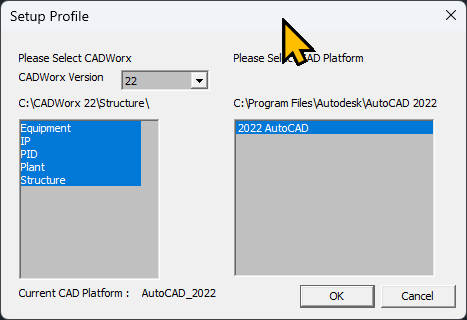
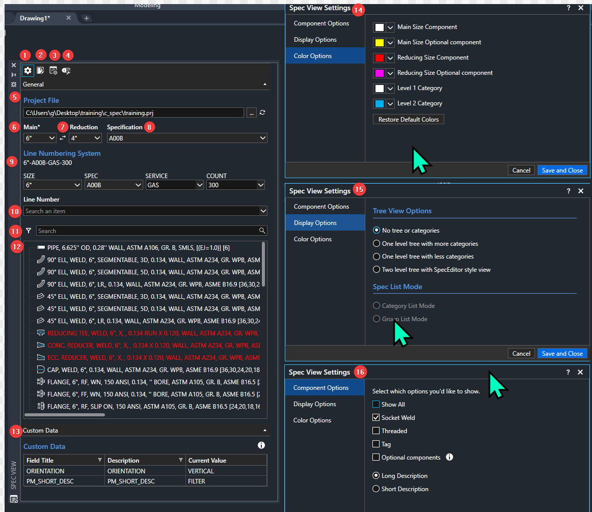

# 1. CADWorx® Plant Training
<p align="center">
  
</p>

- [1. CADWorx® Plant Training](#1-cadworx-plant-training)
  - [1.1. About](#11-about)
  - [1.2. Before you Begin](#12-before-you-begin)
    - [1.2.1. Introduction](#121-introduction)
      - [1.2.1.1. Products](#1211-products)
  - [1.3. Session 1: Core Competency](#13-session-1-core-competency)
    - [1.3.1. Getting Started with CADWorx® (2 hours)](#131-getting-started-with-cadworx-2-hours)
      - [1.3.1.1. In this section](#1311-in-this-section)
      - [1.3.1.2. Launching and setup](#1312-launching-and-setup)
      - [1.3.1.3. Connecting to a Config File](#1313-connecting-to-a-config-file)
      - [1.3.1.4. Connecting to a Project File](#1314-connecting-to-a-project-file)
      - [1.3.1.5. Creating an initial route: Working with the primary functions of CADWorx](#1315-creating-an-initial-route-working-with-the-primary-functions-of-cadworx)
    - [1.3.2. Auto-Routing Options Review](#132-auto-routing-options-review)
    - [1.3.3. Palette Review](#133-palette-review)
  - [1.4. Hands-On Practice](#14-hands-on-practice)
    - [1.4.1. Construct Civil/Structural Foundation](#141-construct-civilstructural-foundation)
    - [1.4.2. Hands-On Practice (1 hour)](#142-hands-on-practice-1-hour)
    - [1.4.3. Review and Wrap-Up (30 minutes)](#143-review-and-wrap-up-30-minutes)
  - [1.5. Session 2: Advanced Features and Practical Applications](#15-session-2-advanced-features-and-practical-applications)
    - [1.5.1. Recap and Introduction to Advanced Features (30 minutes)](#151-recap-and-introduction-to-advanced-features-30-minutes)
    - [1.5.2. Advanced Features (2 hours)](#152-advanced-features-2-hours)
    - [1.5.3. Hands-On Practice (1 hour)](#153-hands-on-practice-1-hour)
    - [1.5.4. Practical Applications (2 hours)](#154-practical-applications-2-hours)
    - [1.5.5. Hands-On Practice (1 hour)](#155-hands-on-practice-1-hour)
    - [1.5.6. Review and Wrap-Up (1 hour)](#156-review-and-wrap-up-1-hour)
- [2. Addendum](#2-addendum)
  - [2.1. About Me](#21-about-me)

## 1.1. About
This document outlines a two-day training course for CADWorx® Plant Professional by Hexagon®, a 3D plant design and modeling software that installs on top of AutoCAD® as an extension.  
The training is broken into two sections and emphasizes quickly learning and applying skills in piping design for new users. It's meant for new CADWorx® Plant end users who are primarly creating Orthographic and Isometric deliverables.  
It assumes the user has a basic understanding of AutoCAD®, and is familiar with the AutoCAD® command language.

## 1.2. Before you Begin
- Install AutoCAD® Plant 3D
- Install CADWorx® Plant
- Ensure both applications are licensed (CADWorx shortcut launches with no errors)
- Download the training.zip to your desktop and unzip.
### 1.2.1. Introduction
- Welcome and Introductions: Brief introduction of the trainer and participants
- Overview of CADWorx®: Purpose and benefits of the application
#### 1.2.1.1. Products
- CADWorx® Product Suite:
  - CADWorx® Plant: 3D piping for plant design and modeling software
  - CADWorx® Equipment: Specialized tool for equipment modeling and design
  - CADWorx® Structure: Structural steel and concrete modeling software
  - CADWorx® P&ID: Intelligent process and instrumentation diagramming tool
- ECE Design Plugins:
  - BUBBLEWorx: Tool for creating and managing bubble annotations in drawings
  - VIEWWorx: Utility for managing and customizing view settings in CADWorx®
  - ISOWorx: Solution for generating and managing isometric drawings
  - ANNOWorx: Tool for creating and managing annotations in CADWorx® models
  - MTOWorx: Material takeoff tool for generating accurate material lists

- Objectives of the Training: What the users will learn and achieve by the end of the training
## 1.3. Session 1: Core Competency

### 1.3.1. Getting Started with CADWorx® (2 hours)
#### 1.3.1.1. In this section
- How to connect to a CADWorx Config file (.cfg) and a CADWorx Project File, (.prj)
- How to use Autorouting in CADWorx
- How to use the Specification View Palette
- How to use the Component List
#### 1.3.1.2. Launching and setup

  > _Note: before launching, consider right clicking the icon, going to properties, and setting /nologo on the shortcut to remove the AutoCAD startup logo._
  1. Download the training.zip to your desktop and unzip.
  2. Click the CADWorx® Plant icon on the desktop  
  
     a. Optional: If it doesn't launch, you may run the setup profile utility:  
       
     b. Optional: you might need to run the CADWorx64Wrapper batch file **(as an administrator)**:  
       
  > _Note: Did CADWorx launch successfully? Try running the CADWORXABOUT command in the command line to verify._
  3. Save a new drawing titled "start.dwg" in your ./training folder.
#### 1.3.1.3. Connecting to a Config File

  4. In AutoCAD, type in SETUP to select the config file. (*.cfg)  
  > _Note: Save your changes, but do not close the dialog._
       
  5. In the setup dialog, go to Configuration Settings > "SpecificationDirectory". Select the "..." dialog and navigate to the ./training folder. Save Changes and close.  
> _Note: This sets the location where your *.prj files are stored for your project. Your company may have specific locations (or network locations) where *prj files are stored._

#### 1.3.1.4. Connecting to a Project File

  6. Open your spec view palette  
       
  7. Select your PRJ file and click open.  Then choose your specification (use a carbon steel class 150 for now)
       

#### 1.3.1.5. Creating an initial route: Working with the primary functions of CADWorx

Let's get some piping components into the drawing, to get us started.

  8. Create an initial route:
  > _Note: Commands after "PIPW" are all ran **inside** that command_.

```
Z A
PIPW enter 0,0,0 enter
move east, 24  
choose 90 LR  
move north, 48  
move east, 24  
pick gate valve  
pick RF flange  
pick standard gasket  
left click on the right side of the route  
enter to end the command  
```
  

  9.  Edit the visual mode:
  > _Note: These are general visual settings for working in CADWorx® Plant.  They are not necessary but usually preferred._  

```
ISOLINES 0  
DISPSILH 1  
REGEN  

```

  10.  Hold down your left shift key and your middle mouse button to rotate the screen. Position to where you can see the 'starting' tie point in your route in an iso view.
  11.  Add elevation to the route:

```
Left click the design grip (+) on the open end of your route to continue autorouting.
west 24
P (to change plane to Z axis)
elevation 48
west 48
L (for component list)
Pick Blind Flange, and standard gasket.
```


  12.  Add inline components
```
search for "check" in your spec view palette. select it.
Use S or E to change the flow of the check
Left click near the east end of the flanged gate connection, and click to add inline.
```


  12.  Add tee components
```
select your pipe route near the origin and click the inline design grip (+)
type "mid" while placing tee, to select center of pipe.
south x.x
east x.x (near the middle of the east most route)
type "PER" and select the pipe route to connect to.
choose "TEE" from the dialog
```


  12.  Add reducing components
```
c:CHANGESIZE Manual.
Select all components on the "bypass" you just routed, minus the the tees.
Choose 4" for the reduction size.
On the East connection, choose a reducing component (CONC reducer)
On the West connection, choose to change current component.
```


  13.  Add inline olets
```
In your specview palette, change Main 4", Reduction 1".
Check your specview pallete settings > threaded on.
search or find "THRD-O-LET" in your specview pallete and select.
while placing the olet, type in NEA for a "near" snap.
click on the bypass parallel to the pipe route.
while placing along length of pipe, use "P" to select the east end, 2" away from weld.
place olet on the top pipe quadrant
```


  13.  Route off olet
```
In your specview palette, change Main 4", Reduction 1".
Check your specview pallete settings > threaded on.
search or find "THRD-O-LET" in your specview pallete and select.
while placing the olet, type in NEA for a "near" snap.
click on the bypass parallel to the pipe route.
while placing along length of pipe, use "P" to select the east end, 2" away from weld.
place olet on the top pipe quadrant
```


### 1.3.2. Auto-Routing Options Review
In this section we routed some components using various tools in the autoroute command. Let's take a closer look at the various commands available.

While Autorouting from NO start point, or the END of an open component, here are the various commands available:

<p align="left">
  
</p>

| Command         | Description |
|-----------------|-------------|
| component <span style="color:orange">**L**</span>ist  |open component list, parts that can be routed with your current spec, fitting type, and nominal size.             |
| <span style="color:orange">**S**</span>lope           |slope the current route             |
| s<span style="color:orange">**K**</span>ew            |skew the current route by * degrees             |
| <span style="color:orange">**E**</span>levation       |elevate the current route            |
| <span style="color:orange">**P**</span>lane           |change the XY plane to XZ or ZY             |
| <span style="color:orange">**R**</span>eference       |change position based on other objects             |
| <span style="color:orange">**F**</span>itting Mode    |swap to socket, threaded, welded mode             |
| el<span style="color:orange">**B**</span>ow type      |change to LR, SR, miter el on autorout             |
| <span style="color:orange">**U**</span>ndo            |undo last step             |
| <span style="color:orange">**C**</span>onnect         |auto connect to a selected point             |
| <span style="color:orange">**T**</span>oggle Length   |measure length from elbow weld or corner             |
| <span style="color:orange">**A**</span>lignment       |align route to a pipe quadrant         |

While Autorouting from inline a pipe component, here are the various commands available:

<p align="left">
  
</p>

| Command         | Description |
|-----------------|-------------|
| component <span style="color:orange">**L**</span>ist            |open component list, for inline parts that can be routed with your current spec, fitting type, and nominal size.             |
| poin<span style="color:orange">**T**</span> distance            |pick a point to measure distance from             |
| <span style="color:orange">**C**</span>omponent distance        |pick a component to measure distance from             |
| <span style="color:orange">**P**</span>ipe end point distance   |toggle pipe end point measuring from            |
| insertion <span style="color:orange">**J**</span>ustification   |select part on your component to measure distance from             |

<center><span style="color:orange; font-size: 2em;">**Knowledge Check!**</span></center>


### 1.3.3. Palette Review

**Spec View Palette**

<p align="center">
  
</p>

| Number | |
|--------|---|
| 1      |Spec View Settings (14,15,16)|
| 2      |Open Spec Editor   |
| 3      |Line Number Setup   |
| **4**      |c:C2A (Set size, spec, line num)    |
| **5**      |Current prj file   |
| **6**      |Current Main size   |
| **7**      |Current Reduction size   |
| **8**      |Current Specification   |
| **9**      |Current Line Number   |
| 10     |Search line numbers   |
| 11     |Search components   |
| 12     |Current components based on main/reduction and spec   |
| 13     |Custom data fields in PRJ file   |
| 14     |Color Options, how the component list (12) is colored   |
| 15     |Display Options, how the component list (12) is listed   |
| **16**     |Component Options, which components are shown based on type   |

**Line View Palette**


**Discontinuity View Palette**


**Clash Detection Palette**


**Insulation Palette**


## 1.4. Hands-On Practice


<p align="center">
  
</p>

Guided excersise to construct a small skid piping model for a fictional project.

 - 2 pumps
 - Horizontal vessel
 - Vertical Vessel
 - ~6 pipe routes

### 1.4.1. Construct Civil/Structural Foundation
Create the 

### 1.4.2. Hands-On Practice (1 hour)
- Guided Exercises: Tasks to practice using the core features
- Q&A Session: Address questions related to core features

### 1.4.3. Review and Wrap-Up (30 minutes)
- Recap of the Day: Summary of what was covered
- Q&A Session: Final questions for the day
- Preview of Day 2: What to expect in the next session

## 1.5. Session 2: Advanced Features and Practical Applications

### 1.5.1. Recap and Introduction to Advanced Features (30 minutes)
- Review of Day 1: Quick recap of core competencies
- Introduction to Advanced Features: Overview of what will be covered

### 1.5.2. Advanced Features (2 hours)
- Advanced Feature 1: Detailed explanation and demonstration
- Advanced Feature 2: Detailed explanation and demonstration
- Advanced Feature 3: Detailed explanation and demonstration

### 1.5.3. Hands-On Practice (1 hour)
- Guided Exercises: Tasks to practice using advanced features
- Q&A Session: Address questions related to advanced features

### 1.5.4. Practical Applications (2 hours)
- Real-World Scenarios: Applying CADWorx® to practical, real-world scenarios relevant to the users
- Case Studies: Examples and case studies of successful CADWorx® usage

### 1.5.5. Hands-On Practice (1 hour)
- Guided Exercises: Tasks based on real-world scenarios and case studies
- Q&A Session: Address questions related to practical applications

### 1.5.6. Review and Wrap-Up (1 hour)
- Recap of the Day: Summary of what was covered
- Q&A Session: Final questions for the day
- Next Steps: Resources for further learning and support
- Feedback Session: Collect feedback from the users about the training

# 2. Addendum

## 2.1. About Me

This training course is led by George Montgomery, M.E., a CAD Administration Consultant and Leica HDS Technical Sales and Support specialist. With extensive experience in both Leica and CAD systems, George brings a wealth of knowledge to this training:

- Expertise in Leica software and hardware sales and support
- Experience providing on-site training for Leica HDS and AutoCAD Plant 3D
- Proficiency in CAD administration, training, and support
- Background in generating project-specific templates and providing consulting feedback on 3D plant specifications

George's diverse skill set in both Leica and CAD systems ensures a comprehensive and practical approach to this CADWorx® Plant training course.
